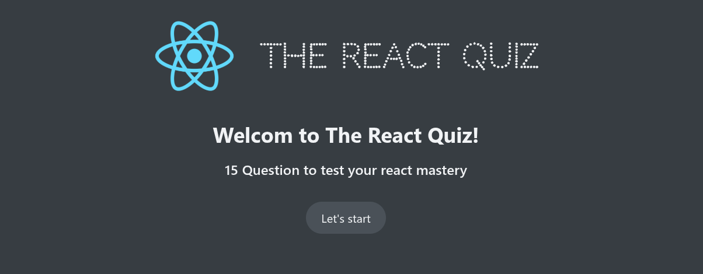

# The React Quiz 🎯

An interactive quiz application built with React to test your React knowledge. Features a timed quiz system with score tracking and a clean, modern UI.




## 🌟 Features

- **15 React Questions** covering fundamental to advanced concepts
- **Timer System** - 30 seconds per question
- **Score Tracking** - Real-time points calculation
- **High Score** - Keeps track of your best performance
- **Progress Bar** - Visual feedback on quiz completion
- **Instant Feedback** - See correct/incorrect answers immediately
- **Responsive Design** - Works on all devices

## 🚀 Demo

Check out the live demo: [React Quiz App](https://momenashraf5.github.io/Quiz-App/)

## 📸 Screenshots

### Start Screen
The welcome screen shows the total number of questions before starting.

### Quiz Interface
- Question display with multiple choice options
- Timer countdown
- Progress tracker showing current question and points
- Next button to move forward

### Results Screen
- Final score with percentage
- Emoji feedback based on performance
- High score display
- Restart option

## 🛠️ Technologies Used

- **React 19** - UI library
- **useReducer** - State management
- **JSON Server** - Mock API for questions
- **CSS3** - Styling
- **Create React App** - Project setup

## 🎮 How to Use

1. Click **"Let's start"** to begin the quiz
2. Select your answer for each question
3. Click **"Next"** to proceed to the next question
4. Complete all 15 questions before time runs out
5. View your final score and compare with your high score
6. Click **"Restart Quiz"** to try again

### Timer System
- 30 seconds per question (450 seconds total for 15 questions)
- Automatically finishes quiz when time expires
- Uses `useEffect` with `setInterval` for countdown

### Scoring
- Each question has point values (10-30 points)
- Maximum possible score: 280 points
- High score persists during session

## 🔧 Customization

### Adding/Editing Questions
Edit `questions.json`:

```json
{
  "question": "Your question here?",
  "options": ["Option 1", "Option 2", "Option 3", "Option 4"],
  "correctOption": 0,
  "points": 10
}
```

## 📝 License

This project is open source and available under the MIT License.

## 👨‍💻 Author

**[Moamen Ashraf]**

- GitHub: [MomenAshraf5](https://github.com/MomenAshraf5)
- Email: moamenashraf533@gmail.com
- LinkedIn: [MoamenAshraf](https://linkedin.com/in/momen-ashraf)

## 🙏 Acknowledgments

- Created with [Create React App](https://create-react-app.dev/)
- React logo from official React assets
- Loader animation from [CSS Loaders](https://dev.to/afif/i-made-100-css-loaders-for-your-next-project-4eje)

---

⭐ If you found this project helpful, please give it a star!
